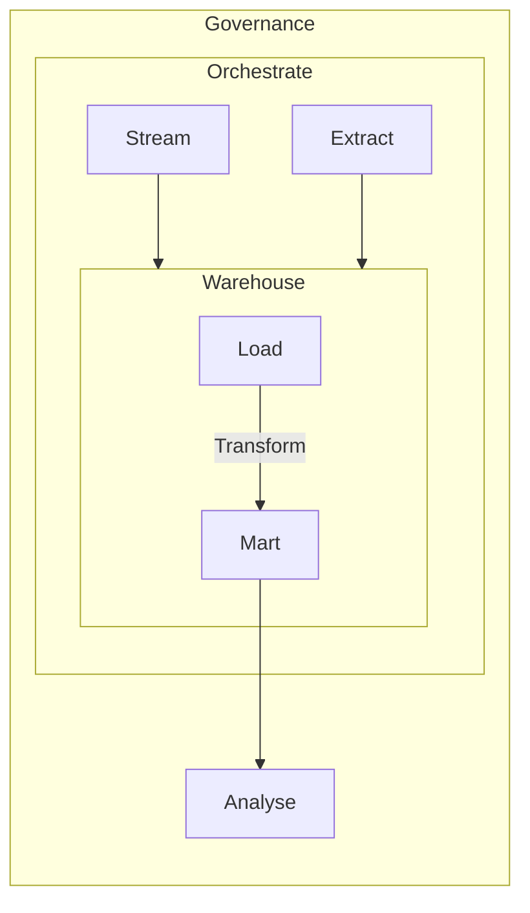
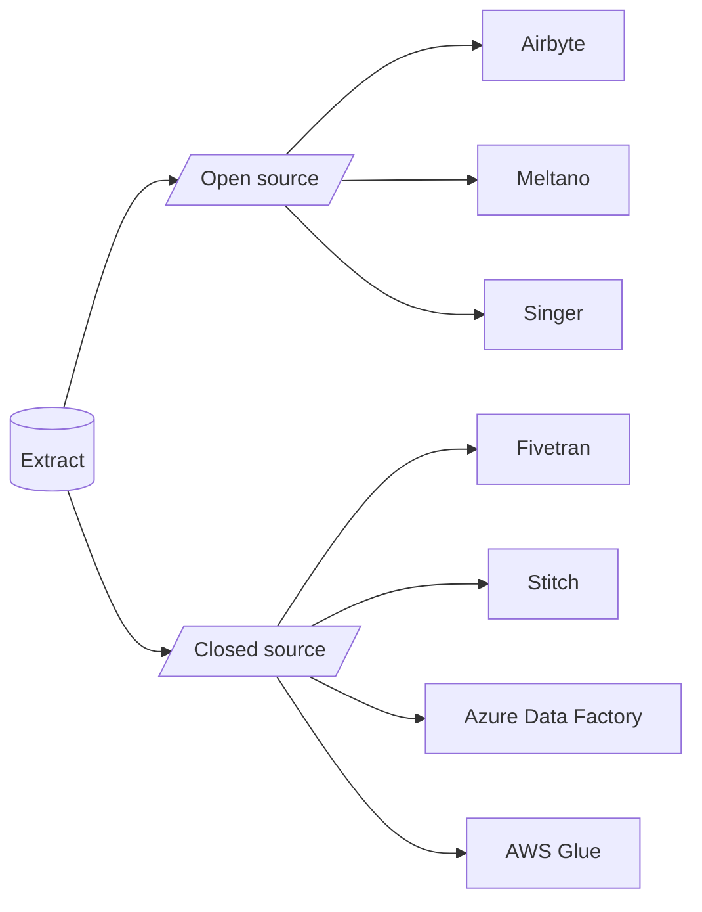
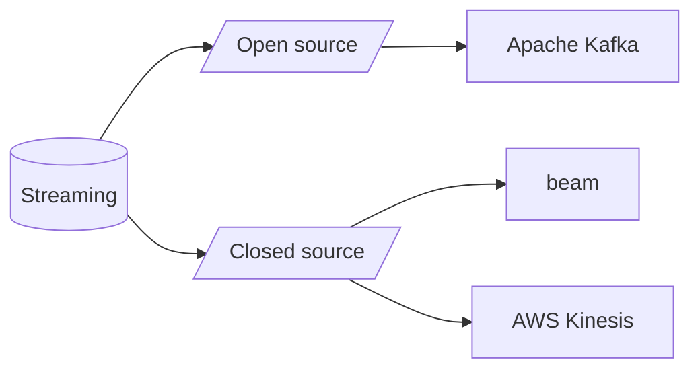
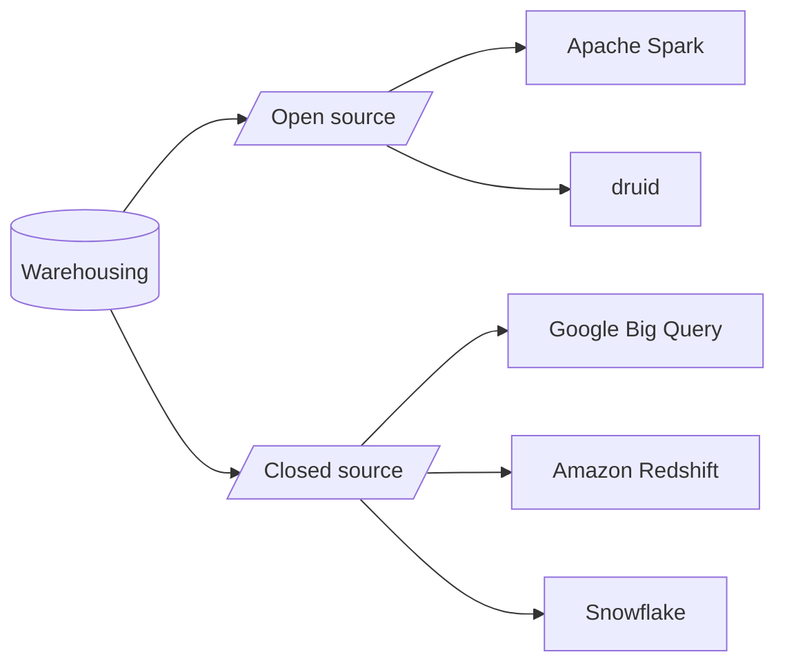
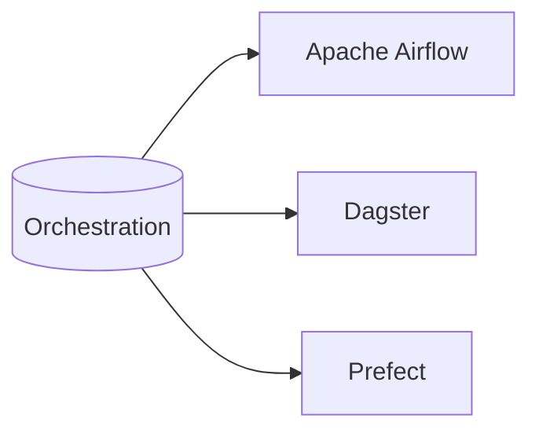
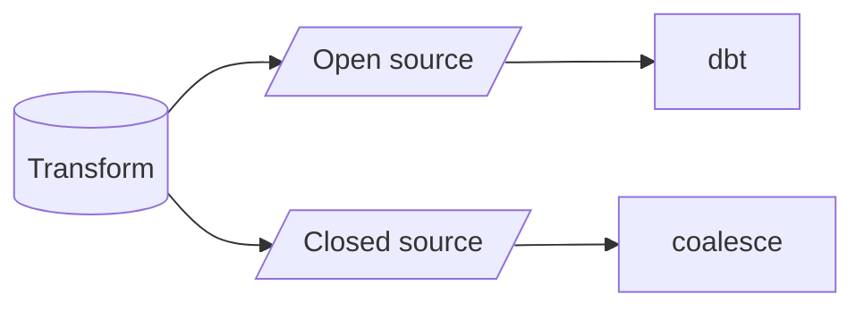
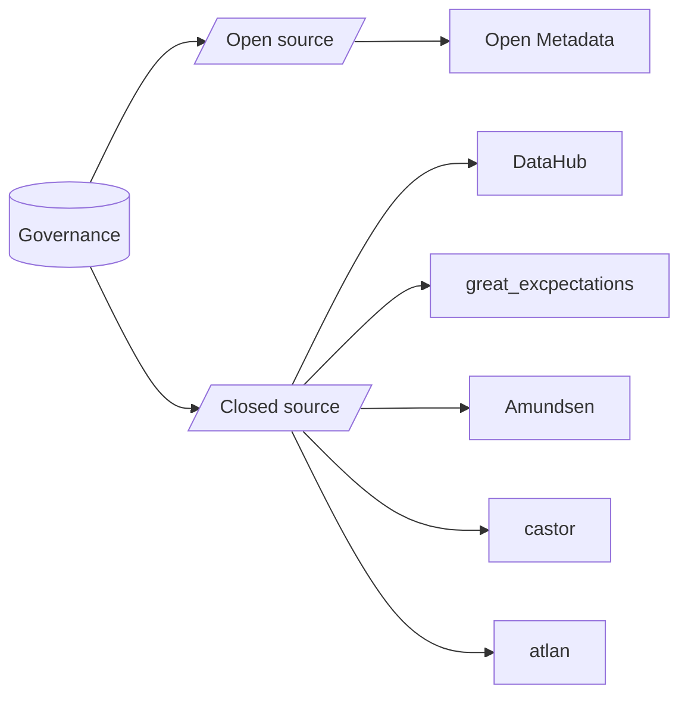
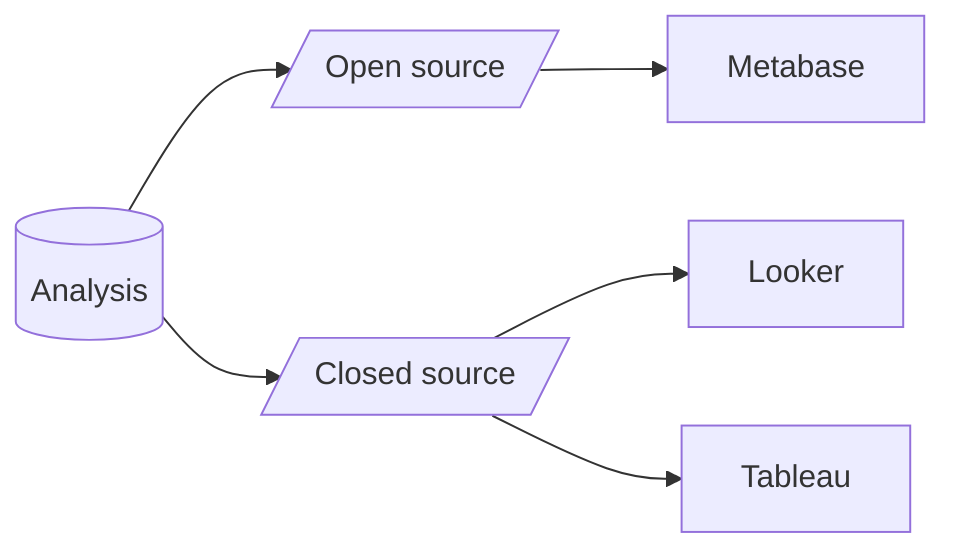

--- 
title: Data Engineering Techstack
date: 2023-09-04 18:22:22 +1200
mermaid: true
published: true
---

## Overview

Data engineering is the field of designing and managing the architecture, infrastructure, and processes for 
collecting, storing, and processing data in a way that is reliable, scalable, and efficient. 
It focuses on ensuring that data is available, accessible, and ready for analysis by 
data scientists, analysts, and other stakeholders within an organization.

Below is modern architecture for data engineering. 
This article provides a brief description of each component of this architecture and 
provides the tools that can be used to achieve this architecture.

---

## Extract

Data extract typically refers to a subset or snapshot of data extracted from a source system, 
such as a database or application, for the purpose of further processing, analysis, or storage

---

## Streaming

Data streaming is the real-time or near-real-time continuous flow of data from various sources to a destination, 
such as a data processing system or storage, without the need for storing the entire dataset at once.

---

## Warehousing

A data warehouse is a specialized, centralized repository that stores large volumes of data 
collected from the extract and streaming.
It is designed to support complex querying and reporting, providing a historical and 
integrated view of data that enables efficient data analysis and informed decision-making.

---

## Orchestration

Orchestration refers to the coordination and management of data processing tasks and 
workflows in a systematic and automated manner. 
It involves designing, scheduling and monitoring the execution of data pipelines 
and processes to ensure data is collected, transformed, and 
loaded efficiently and reliably across various systems and stages of the data lifecycle

---

## Transform

Transformation refers to the process of converting and altering data from its original format 
into a desired structure or schema. This can involve various operations like 
filtering, aggregating, cleaning, and enriching the data to make it suitable for 
analysis, reporting, or storage in a data warehouse or other systems.

---

## Governance

Governance refers to the set of policies, processes, and controls put in place to ensure 
the quality, security, and compliance of data throughout its lifecycle. 
It involves establishing guidelines for data collection, storage, access, and usage, as well as 
implementing mechanisms for data auditing, monitoring, and enforcement to 
maintain data integrity and align with regulatory requirements.

---

## Analysis

Analysis refers to the process of examining and interpreting data to derive meaningful 
insights, trends, and patterns that can inform decision-making and provide valuable information to an organization. 
It typically involves the use of various tools, techniques, and algorithms to explore and 
extract valuable information from large datasets.

