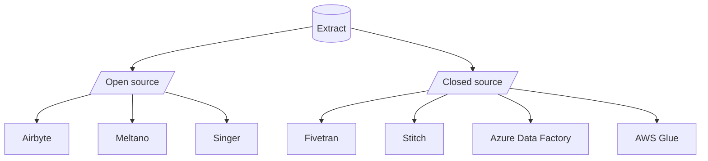
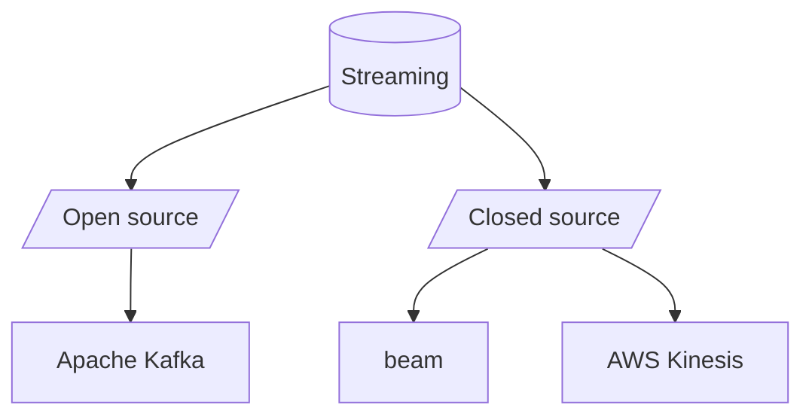
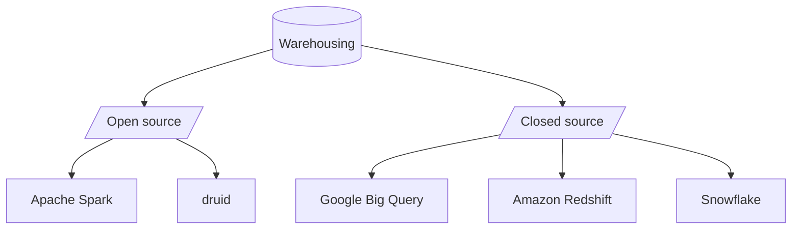
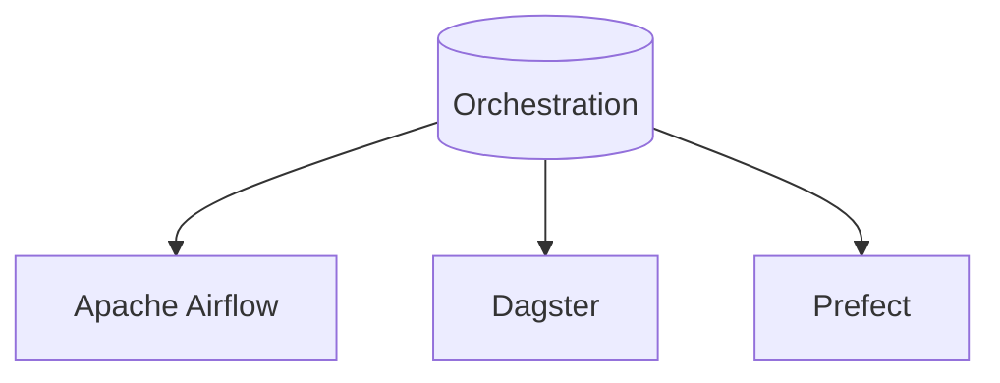
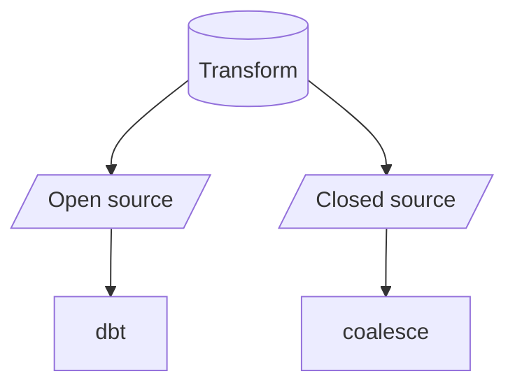
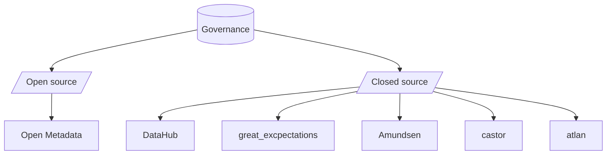
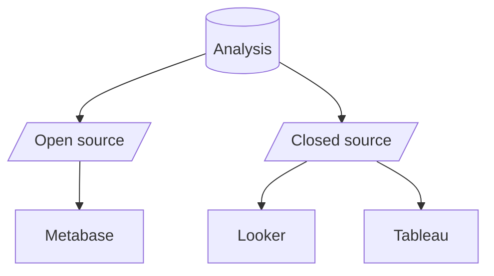

```mermaid
 flowchart

  extract[(Extract)] 
  opensource[/Open source/] 
  extract --> opensource
  opensource --> Airbyte 
  opensource --> Meltano
  opensource --> Singer 

  closedsource[/Closed source/] 
  adf[Azure Data Factory]
  aws_glue[AWS Glue]
  extract --> closedsource
  closedsource --> Fivetran 
  closedsource --> Stitch 
  closedsource --> adf
  closedsource --> aws_glue 
```

---

```mermaid
 flowchart

  streaming[(Streaming)] 
  opensource[/Open source/] 
  streaming --> opensource
  kafka[Apache Kafka]
  opensource --> kafka

  closedsource[/Closed source/] 
  streaming --> closedsource
  kinesis[AWS Kinesis]
  closedsource --> beam
  closedsource --> kinesis

```

---

```mermaid
 flowchart

  warehouse[(Warehousing)] 

  opensource[/Open source/] 
  warehouse --> opensource

  spark[Apache Spark]
  opensource --> spark
  opensource --> druid

  closedsource[/Closed source/] 
  warehouse --> closedsource
  bq[Google Big Query]
  redshift[Amazon Redshift]

  closedsource --> bq
  closedsource --> redshift
  closedsource --> Snowflake
```

---

```mermaid
 flowchart

  orchestration[(Orchestration)] 

  airflow[Apache Airflow] 
  orchestration --> airflow
  orchestration --> Dagster
  orchestration --> Prefect
```

---

```mermaid
 flowchart

  transform[(Transform)] 

  opensource[/Open source/] 
  transform --> opensource

  opensource --> dbt

  closedsource[/Closed source/] 
  transform --> closedsource
  closedsource --> coalesce
```

---

```mermaid
 flowchart

  governance[(Governance)] 

  opensource[/Open source/] 
  governance --> opensource

  open_metadata[Open Metadata]
  opensource --> open_metadata

  closedsource[/Closed source/] 
  governance --> closedsource
  closedsource --> DataHub
  closedsource --> great_excpectations
  closedsource --> Amundsen
  closedsource --> castor
  closedsource --> atlan
```

---

```mermaid
 flowchart

  analysis[(Analysis)] 

  opensource[/Open source/] 
  analysis --> opensource

  opensource --> Metabase

  closedsource[/Closed source/] 
  analysis --> closedsource
  closedsource --> Looker
  closedsource --> Tableau
```

