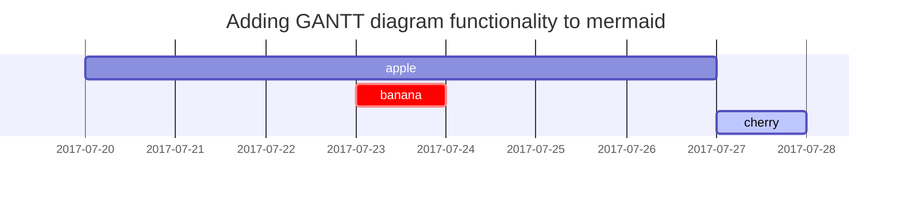

# Extract 

Tools to extract data from a source to a landing zone / data warehouse

## Open source 
- Airbyte 
- Meltano
- Singer 

## Closed source 
- Fivetran 
- Stitch 
- Azure Data Factory
- AWS Glue

## Streaming
- Apache Kafka
- beam
- AWS Kinesis 

# Warehousing

## Open source 
- Apache Spark
- druid

## Closed source 
- Google Big Query
- Snowflake
- Amazon Redshift

# Orchestration
- Apache Airflow
- Dagster
- Prefect

# Transform 
- dbt
- coalesce

# Governance 

## Open source 
- Open Metadata

## Closed source
- DataHub
- great_excpectations
- Amundsen
- castor
- atlan

# Analysis

## Open source
- Metabase
- Looker
- Tableau

